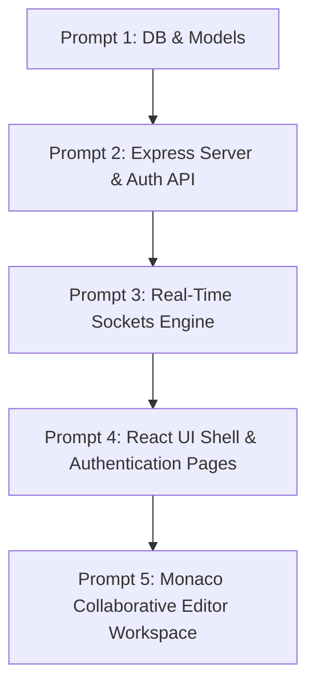

# 📘 CodeSync: Product Manager Prompts Handbook

This handbook contains a suite of five production-grade, highly specific Antigravity prompts. They are structured by a Senior Product Manager to guide an AI coding agent or developers in building the entire **CodeSync** application step-by-step.

---

## 📂 Prompt Execution Workflow



---

## 🗂️ Prompt 1: Database & Mongoose Schemas

### Scope
Create the persistent database tier using MongoDB and Mongoose. Define schema modeling for Users (with cryptographically hashed passwords), Rooms (tracking active collaborative states), and SavedSnippets (persisting work for returning users).

---

### 📝 Antigravity Prompt

```markdown
Act as an expert backend database architect. We are building the database layer for CodeSync, a collaborative real-time code editor. The database will use MongoDB and Mongoose (ODM).

Please create the database models inside a directory named `backend/models/`. Include the following structures and business logic:

1. Create a `User.js` model:
   - Schema Fields:
     * `username`: String, unique, required, trim, minlength: 3, maxlength: 20
     * `email`: String, unique, required, lowercase, trim, validates with a robust regex
     * `password`: String, required, minlength: 6 (select: false as default to prevent accidental leaks)
     * `createdAt`: Date, defaults to Date.now
   - Hooks & Methods:
     * A pre-save hook that hashes the password using bcryptjs (salt factor of 12) if the password field is modified.
     * A schema method named `comparePassword(candidatePassword)` that uses bcrypt to securely compare entered passwords during login.

2. Create a `Room.js` model:
   - Schema Fields:
     * `roomId`: String, unique, required, index (UUID format generated by the client or server)
     * `name`: String, required, trim
     * `codeState`: String, defaults to a starter "Hello World" template based on language
     * `language`: String, required, defaults to "javascript", enum values: ['javascript', 'python', 'cpp', 'java', 'html']
     * `activeUsers`: Array of ObjectIds referencing the User schema (or Guest string arrays if non-authenticated guests join)
     * `createdAt`: Date, default Date.now, expires after 24 hours (a TTL index to clean up unused collaborative rooms)

3. Create a `Snippet.js` model:
   - Schema Fields:
     * `title`: String, required, trim
     * `code`: String, required
     * `language`: String, required
     * `owner`: ObjectId referencing the `User` model, required
     * `sharedLink`: String, unique (a secure hash used for public read-only views)
     * `updatedAt`: Date, defaults to Date.now

Ensure all files contain clean import statements, detailed JSDoc comments explaining fields, robust error validation, and export statements. Address corner cases like password hashing trigger on save versus update.
```

---

## 🗂️ Prompt 2: Express Server & Secure JWT Authentication API

### Scope
Build the core Express web server. Establish middleware architectures for JWT-based session security, secure HTTP cookies, CORS configurations, database connections, and standard authentication endpoints.

---

### 📝 Antigravity Prompt

```markdown
Act as a Principal Node.js & Express Security Engineer. We need to build the foundational backend web server and JWT authentication API for CodeSync.

Write a complete Express application in the `backend/` directory.

The application must include the following structural specifications:

1. Core Configuration (`backend/server.js` and `backend/config/db.js`):
   - Set up an Express application parsing JSON payloads (`express.json()`) and cookies (`cookie-parser`).
   - Enable CORS with the `cors` package, specifically permitting the `CLIENT_URL` environment variable with `credentials: true`.
   - Setup a clean database connection in `db.js` utilizing `mongoose.connect()` with listeners for successful connection, error logging, and graceful teardown.

2. Authentication Middleware (`backend/middleware/auth.js`):
   - A middleware function named `protect` that extracts a `token` from `req.cookies.token` or from Authorization headers (`Bearer <token>`).
   - It must verify the token using `jwt.verify()` against a `JWT_SECRET`.
   - If valid, fetch the User profile (excluding password) and attach it to `req.user`. If invalid or expired, return a clear 401 JSON error code.

3. Authentication Routes & Controllers (`backend/routes/auth.js`, `backend/controllers/auth.js`):
   - `POST /api/auth/register`: Takes username, email, password. Validates input, checks for duplicates, creates the user, generates a JWT, sets it inside an HTTP-only secure cookie, and returns the user payload.
   - `POST /api/auth/login`: Takes email, password. Fetches the user with password selection, verifies password using `comparePassword`, sets the JWT cookie, and returns user details.
   - `POST /api/auth/logout`: Clears the `token` cookie and sends a success status.
   - `GET /api/auth/me`: Protected route returning the current logged-in user profile.

4. Room API Endpoint Layouts (`backend/routes/rooms.js`):
   - Create endpoints to validate Room IDs or to save snippets linked to active User sessions.
   - Provide fallback handlers for 404 (Not Found) and a global error handling middleware to capture stack traces in development.

Use clean, modern ES Modules structure (`import`/`export` instead of `require`). Write production-grade code including secure HTTP cookie settings (httpOnly: true, secure: true/false based on NODE_ENV, sameSite: 'strict').
```

---

## 🗂️ Prompt 3: Real-Time Sockets Collaboration Engine

### Scope
Design and implement the real-time core of the application using Socket.IO. Configure channels to track users in active rooms, broadcast code changes instantly, handle typing indicators, and update active user cards dynamically.

---

### 📝 Antigravity Prompt

```markdown
Act as an expert real-time systems architect. We are building the real-time collaboration layer of CodeSync using Node.js, Express, and Socket.IO.

Create a Socket.IO manager at `backend/socket/socketHandler.js` (integrated into the HTTP server inside `server.js`).

Implement the following features and event protocols:

1. Socket Initialization:
   - Configure Socket.IO with standard CORS parameters matching your Express settings (allowing credentials, setting origins).
   - Maintain a memory-based or Redis-compatible active mapping to track sockets: `const socketUserMap = {}` where the key is the socket ID and value is `{ username, roomId, userId }`.

2. Real-Time WebSocket Events:
   - Event `join-room`:
     * Takes payload: `{ roomId, username, userId }`.
     * Pins the user to the socket ID and calls `socket.join(roomId)`.
     * Fetches all active participants currently connected to `roomId` and broadcasts the `user-joined` event to all sockets in that room (including the joining socket, or as a room broadcast).
     * The `user-joined` response must return the list of all connected users to allow clients to update their participant arrays.
   - Event `code-change`:
     * Takes payload: `{ roomId, code }`.
     * Broadcasts `code-update` containing the new code state using `socket.in(roomId).emit('code-update', code)`. Do NOT broadcast back to the sender socket to prevent cursor resetting.
   - Event `language-change`:
     * Takes payload: `{ roomId, language }`.
     * Broadcasts `language-update` with the string value of the selected programming language.
   - Event `cursor-move`:
     * Takes payload: `{ roomId, position: { lineNumber, column }, username }`.
     * Broadcasts `cursor-update` containing cursor offsets for real-time cursor visualizations on other client frames.
   - Event `send-message`:
     * Takes payload: `{ roomId, message, sender }`.
     * Broadcasts `new-message` to the room for live chat collaboration.

3. Disconnection Lifecycle:
   - Listening to native `disconnecting` or `disconnect` event:
     * Identify the user's details and active `roomId` from the memory mapping.
     * Remove the user from the mapping.
     * Emit a `user-left` event to all other clients in `roomId` with the updated roster list.
     * Call `socket.leave(roomId)` cleanups.

Write this module using robust exception handling. Ensure clean logs indicating when clients connect or drop, and structure the server so it can easily support scaling to multiple processes in the future.
```

---

## 🗂️ Prompt 4: Premium React Frontend Shell, Dynamic Auth Routing & Home Page

### Scope
Bootstrap the frontend using Vite and React. Create the typography systems, custom CSS configurations, and build a glassmorphic design system using Tailwind HSL colors, featuring smooth transitions, beautiful authentication pages, and dashboards.

---

### 📝 Antigravity Prompt

```markdown
Act as a Senior UI/UX Engineer and Frontend Developer. We are building the React frontend for CodeSync, using Vite, Tailwind CSS, and React Router Dom.

Set up the core frontend repository under `frontend/` directory with an emphasis on rich visuals (dynamic gradients, glassmorphism, responsive cards, micro-animations).

Provide the following configurations and page modules:

1. Design Tokens and Global Style Config (`frontend/src/index.css` and `frontend/tailwind.config.js`):
   - Configure Tailwind with a dark theme as primary, incorporating dynamic dark slate, violet accent glows (`#7c3aed`), and glassmorphism borders.
   - Define custom scrollbar styling, pulse animations for indicators, and modern font pairings (e.g., Google Fonts 'Outfit' and 'JetBrains Mono').

2. React Context & Sockets Provider (`frontend/src/context/AuthContext.jsx` and `frontend/src/hooks/useSocket.js`):
   - Implement an AuthContext tracking `user`, `loading`, and `isAuthenticated` states. Provide functions for login, registration, and logout (calling backend REST APIs with Axios/Fetch).
   - Write a custom `useSocket` hook that initializes `socket.io-client` with the backend server URL only when a user joins an active Room Session, and ensures the socket connection is closed/cleaned up on unmount.

3. Routing Architecture (`frontend/src/App.jsx`):
   - Create Route protections: `ProtectedRoute` (redirecting non-logged users to login) and public-only routes.
   - Establish navigation routes:
     * `/`: Landing and Join Room page (has beautiful glassmorphic forms to either "Create a Room" or "Join an Existing Room" with unique Room IDs).
     * `/login` & `/register`: Gorgeous, animated login and sign-up cards.
     * `/dashboard`: Protected dashboard displaying saved code snippets, active user metrics, profile settings, and previous collaborative room summaries.

Make sure the components are fully responsive, look exceptionally premium, utilize proper HTML5 elements, and utilize `react-hot-toast` for fluid feedback notifications (such as "Room ID copied to clipboard!" or "Failed to connect to backend").
```

---

## 🗂️ Prompt 5: Interactive Monaco Code Editor Panel & Real-time Client

### Scope
Create the main collaborative coding interface. Integrate Microsoft's Monaco Editor component, bind key WebSocket event hooks, implement real-time syntax checking, cursors styling, active collaborator sidebars, and direct formatting tools.

---

### 📝 Antigravity Prompt

```markdown
Act as a Senior WebSockets and Frontend Editor Engineer. We need to construct the centerpiece of CodeSync: the real-time collaborative workspace containing the Monaco Editor integration.

Write the React page component at `frontend/src/pages/EditorWorkspace.jsx` and auxiliary subcomponents.

Implement the following features and interactive layouts:

1. Layout Structure:
   - Split screen containing:
     * A premium glassmorphic sidebar (20% width) displaying the CodeSync logo, active room ID with a "Copy Link" helper, list of connected users (with avatar circles and animated pulse indicators), language selection dropdown, and a live in-room text chat tab.
     * The Monaco Editor panel (80% width) occupying the remainder of the viewport.

2. Monaco Editor Integration (`@monaco-editor/react`):
   - Configure the editor component with dark mode theme (`vs-dark`).
   - Bind editor actions: disable minimap options, enable word-wrap, configure automatic font size resizing, and set up 'Format Document' key bindings.

3. WebSocket Event bindings & Keystroke Synchronization:
   - On editor initialization, bind `onChange` hooks to catch code adjustments:
     * Throttle/debounce cursor location emissions.
     * When code edits are made locally, fire `code-change` events over the socket connection.
     * When receiving a `code-update` event from the Socket server, update the Monaco Editor value programmatically. Make sure this updates the editor without moving the user's active cursor or resetting history states (use editor reference `editorRef.current.setValue()` carefully, or use editor model changes instead).
   - Listen to `user-joined` and `user-left` events, updating the live user sidebar dynamically and alerting the user with a notification toast.
   - Bind the language dropdown: on updating the dropdown, dispatch `language-change` to update other room models instantly.

4. Client UX Additions:
   - Include direct actions like "Clean Code" (code formatting via built-in Monaco actions), "Export Code" (downloads code as a file matching the selected language extension), and "Save Snippet" (makes a REST API request to save code to user snippet history).

Include extensive fallback systems for lost socket connections, displaying a "Reconnecting..." indicator when Socket status changes. Use professional layout standards.
```
